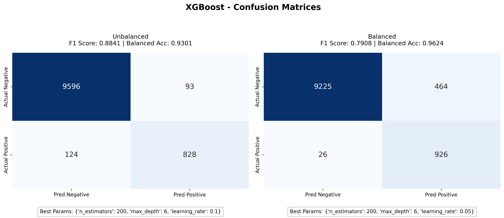
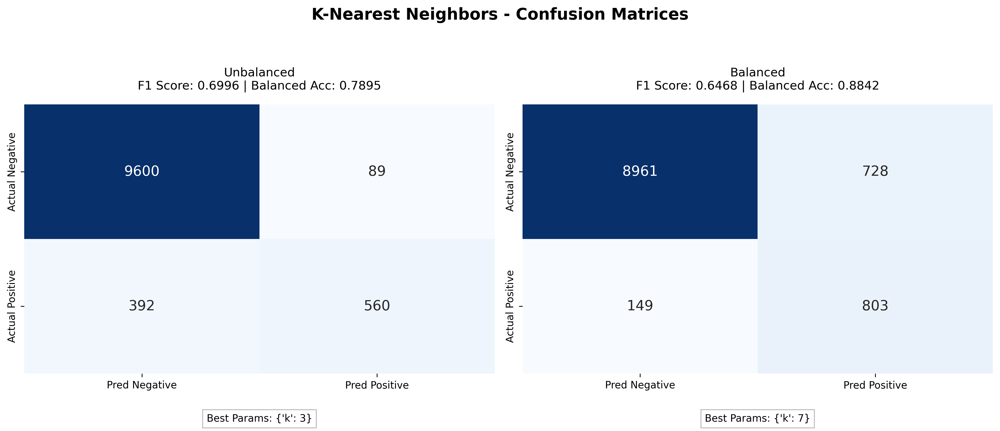
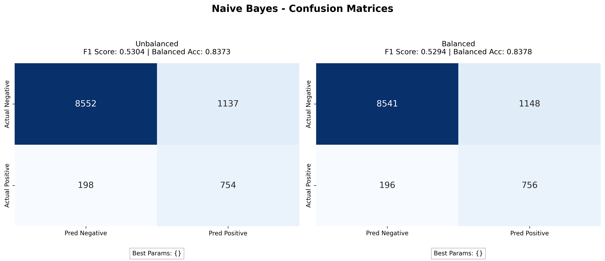
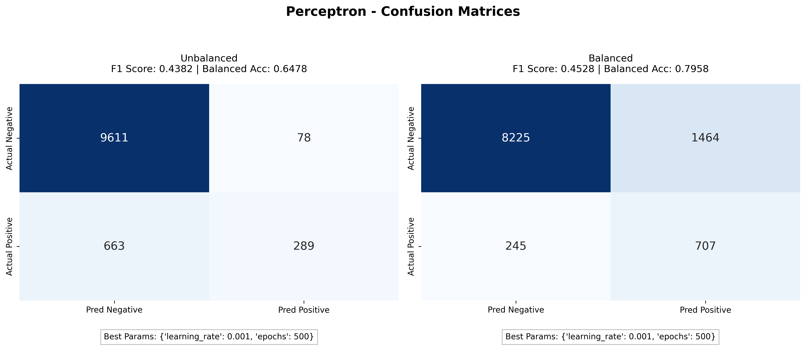

# Data Mining: Time-Series Imbalanced Data Classification

## Overview & Approach

This project tackles a binary classification task on a time-series, noise-removed signal sampled at 100 Hz. The dataset is heavily imbalanced, with class '0' acting as the majority and class '1' as the minority. Per the project requirements, we handled this imbalance without removing any minority samples or up-sampling them.

Our methodology included the following steps:

- **Data Preprocessing:** We implemented a sliding window technique with a length of 50 samples and a 50% overlap. A window was labeled '1' if more than 40% of its rows were '1'; otherwise, it was labeled '0'.
- **Feature Flattening:** Each (50 x 9) window matrix was flattened into a single 450-dimensional feature vector to be compatible with standard 1D classifiers.
- **Handling Imbalance:** We utilized inverse frequency class weighting to assign a higher loss penalty to the minority class, ensuring mistakes on class '1' samples were penalized more heavily during training.
- **Model Training & Validation:** We trained four supervised classifiers: K-Nearest Neighbours, Naive Bayes, Perceptron, and XGBoost. Hyperparameter tuning was conducted using 5-fold stratified cross-validation to maintain the class ratio across all splits.

## Project Structure

The repository is organized into modular directories for data, source code, and outputs:

```text
.
├── README.md
├── requirements.txt
├── main.py
├── assignment_report.docx
├── data/
│   ├── Sample_Test/
│   ├── Sample_Training/
│   ├── test/
│   └── train/
├── src/
│   ├── balancing.py
│   ├── evaluation.py
│   ├── preprocessing.py
│   ├── visualize.py
│   └── models/
└── Results/
    ├── res_4.txt
    ├── xgboost_cm_comparison.png
    ├── k-nearest_neighbors_cm_comparison.png
    ├── naive_bayes_cm_comparison.png
    └── perceptron_cm_comparison.png
```

## Results

Across all four models, applying class weighting consistently improved recall for the minority class and raised the balanced accuracy. XGBoost was the strongest performing model out of the four. With class weighting applied, XGBoost achieved a balanced accuracy of 0.9624 and correctly identified almost all actual minority class samples (reducing false negatives to 26).

### Model Performance Metrics

**Without Class Weighting:**
| Model | TP | TN | FP | FN | F1 Score | Bal. Acc. |
| :--- | :--- | :--- | :--- | :--- | :--- | :--- |
| **KNN** | 560 | 9600 | 89 | 392 | 0.6996 | 0.7895 |
| **Naive Bayes** | 754 | 8552 | 1137 | 198 | 0.5304 | 0.8373 |
| **Perceptron** | 289 | 9611 | 78 | 663 | 0.4382 | 0.6478 |
| **XGBoost** | 828 | 9596 | 93 | 124 | 0.8841 | 0.9301 |

**With Class Weighting (Balanced):**
| Model | TP | TN | FP | FN | F1 Score | Bal. Acc. |
| :--- | :--- | :--- | :--- | :--- | :--- | :--- |
| **KNN** | 803 | 8961 | 728 | 149 | 0.6468 | 0.8842 |
| **Naive Bayes** | 756 | 8541 | 1148 | 196 | 0.5294 | 0.8378 |
| **Perceptron** | 707 | 8225 | 1464 | 245 | 0.4528 | 0.7958 |
| **XGBoost** | 926 | 9225 | 464 | 26 | 0.7908 | 0.9624 |

### Confusion Matrices

Below are the side-by-side comparisons of the confusion matrices for each model, showing performance with and without class weighting. You can find these high-resolution images in the `Results/` directory.

**XGBoost**


**K-Nearest Neighbors**


**Naive Bayes**


**Perceptron**


---

## Academic Context

- **Assignment:** Data Mining Assignment-cum-project
- **Department:** AI/ML
- **Term:** SP 2026

**Group - 5 Members:**

- Venkat Saahit Kamu [BTECH/10904/23]
- Harshith Agarwal [BTECH/10721/23]
- Prashant Kumar [BTECH/10247/23]
- Tejashwin K Nayak [BTECH/10751/23]
